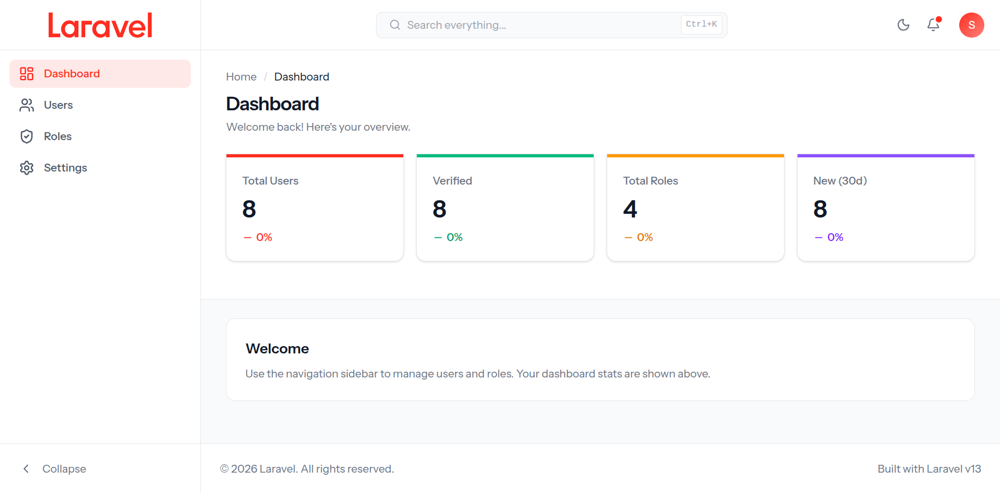

<div align="center">

# Laravel Starter Kit



[](https://laravel.com)
[](https://svelte.dev)
[](https://inertiajs.com)
[](https://tailwindcss.com)
[](https://pestphp.com)
[](LICENSE)

A production-ready Laravel 13 starter kit with Inertia.js v3 + Svelte 5, featuring role-based access control, responsive dashboard layout, and dark mode support.

</div>

---

## Features

- **Role-Based Access Control** — Custom RBAC with 4 permission tiers (Super Admin, Admin, Editor, Viewer)
- **User & Role Management** — Full CRUD with validation and search
- **Global Search** — Debounced search with `Ctrl+K` keyboard shortcut
- **Dark Mode** — Light, dark, and system theme with localStorage persistence
- **Responsive Layout** — Collapsible sidebar, mobile hamburger menu
- **Authentication** — Login, register, forgot/reset password, email verification
- **Profile Management** — Edit profile with password update
- **Type-Safe Routes** — Wayfinder auto-generates TypeScript route helpers

## Installation

### Quick Setup

```bash
composer run setup
```

This runs all steps below automatically:

### Manual Setup

```bash
# Clone the repository
git clone https://github.com/ajangsupardi/larastart.git
cd larastart

# Install PHP dependencies
composer install

# Copy environment file and generate app key
cp .env.example .env
php artisan key:generate

# Run database migrations with seed data
php artisan migrate --force

# Install Node dependencies and build assets
npm install
npm run build
```

### Default Accounts

After seeding, the following accounts are available:

| Role | Email | Password |
|------|-------|----------|
| Super Admin | `super@example.com` | `password` |
| Admin | `admin@example.com` | `password` |
| Editor | `editor@example.com` | `password` |
| Viewer | `viewer@example.com` | `password` |

## Development

```bash
composer run dev
```

This starts all services concurrently:

| Service | Purpose |
|---------|---------|
| `php artisan serve` | HTTP server |
| `php artisan queue:listen` | Queue worker |
| `php artisan pail` | Log viewer |
| `npm run dev` | Vite dev server |

## Testing

```bash
# Run all tests
php artisan test --compact

# Run specific test suite
php artisan test --compact --filter=UserControllerTest
```

## Project Structure

```
├── app/
│   ├── Http/
│   │   ├── Controllers/       # Controller classes
│   │   ├── Middleware/        # Inertia + Permission middleware
│   │   ├── Requests/          # Form request validation
│   │   └── Resources/         # API resources
│   ├── Models/                # Eloquent models (User, Role)
│   └── Notifications/         # Email notifications
├── database/
│   ├── factories/             # Model factories
│   ├── migrations/            # Database migrations
│   └── seeders/               # Database seeders
├── resources/js/
│   ├── actions/               # Wayfinder generated actions
│   ├── components/            # Reusable Svelte components
│   ├── layouts/               # Dashboard & Auth layouts
│   │   └── parts/             # Sidebar, Topbar, Footer, etc.
│   ├── lib/                   # Utility functions
│   ├── pages/                 # Inertia page components
│   │   ├── auth/              # Auth pages
│   │   ├── Users/             # User management
│   │   ├── Roles/             # Role management
│   │   └── Profile/           # Profile pages
│   ├── routes/                # Wayfinder generated routes
│   ├── stores/                # Svelte writable stores
│   └── types/                 # TypeScript type definitions
├── routes/                    # Laravel route definitions
└── tests/                     # Pest test suites
```

## Role-Based Access Control

The RBAC system uses a `permissions` JSON field on roles, structured as `{ resource: [actions] }`.

| Role | Users | Roles | Permissions |
|------|-------|-------|-------------|
| **Super Admin** | CRUD | CRUD | Full access to all resources |
| **Admin** | R, U, D | R | No user creation |
| **Editor** | CRUD | R | Can manage users, read roles |
| **Viewer** | R | R | Read-only access |

### Protected Routes

Routes are protected via the `permission` middleware alias:

```php
Route::get('/users/create', [UserController::class, 'create'])
    ->middleware('permission:users,create');
```

## Code Quality

```bash
# PHP formatting (Pint)
composer lint

# JavaScript/TypeScript linting (ESLint)
npm run lint

# Frontend formatting (Prettier)
npm run format

# TypeScript type checking
npm run types:check

# CI check (all of the above + tests)
composer ci:check
```

## License

This project is open-sourced under the [MIT License](LICENSE).
